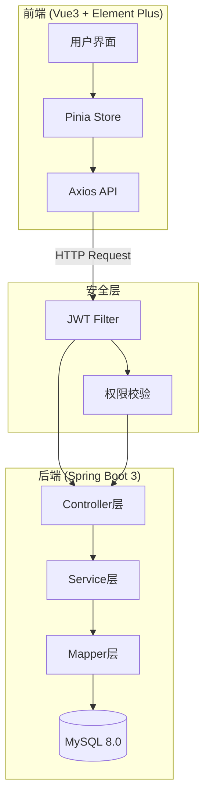
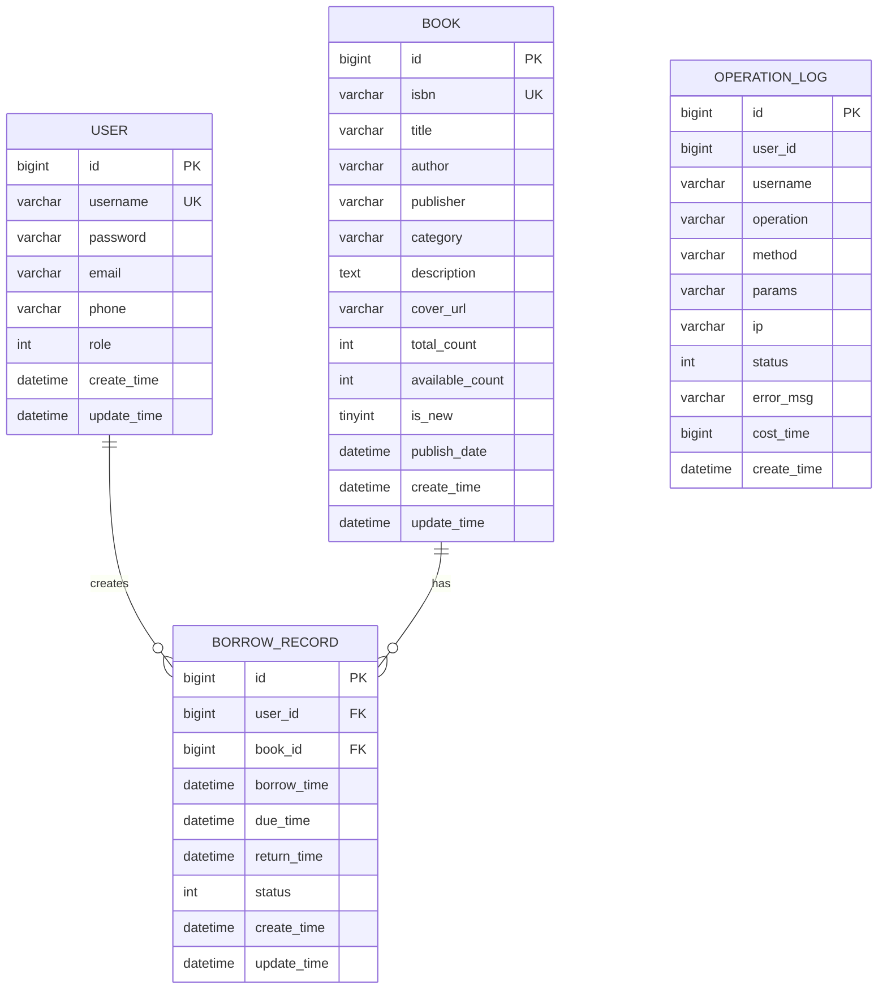
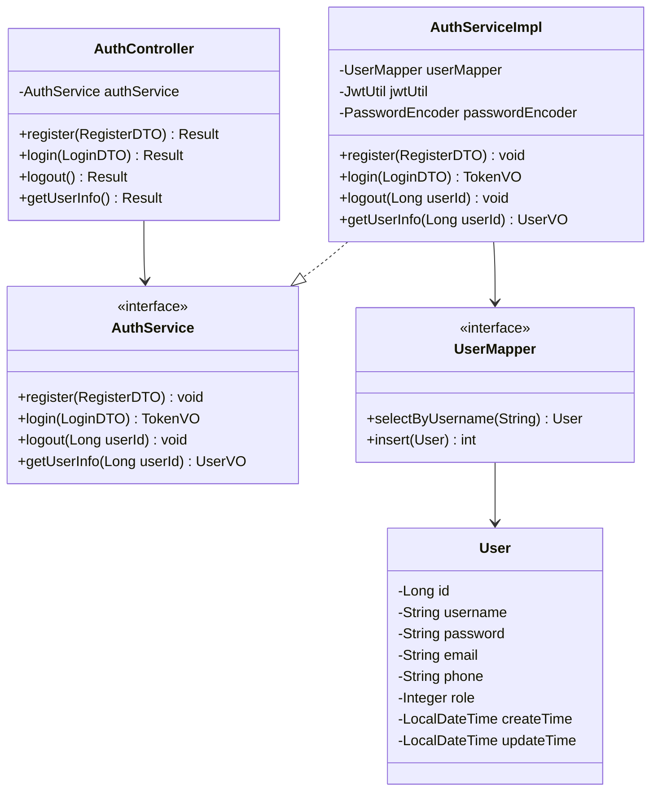
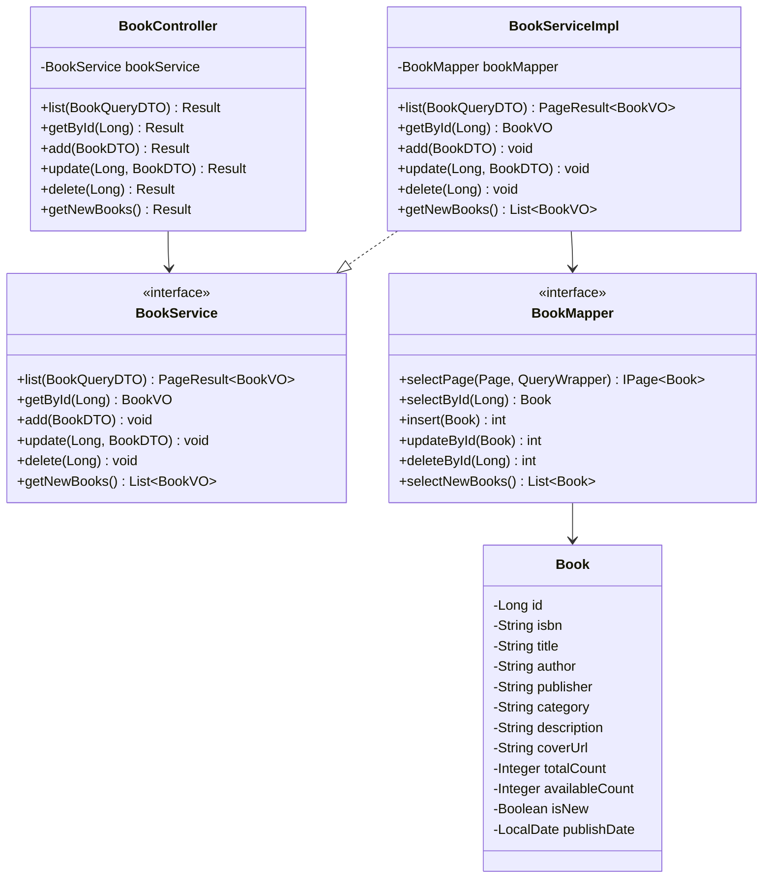
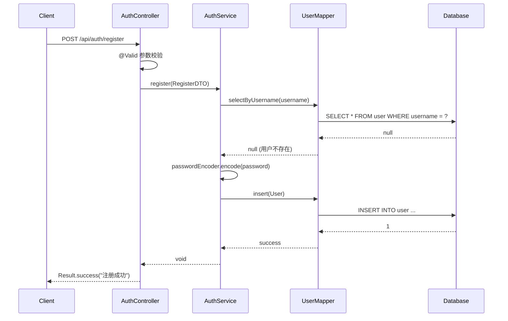
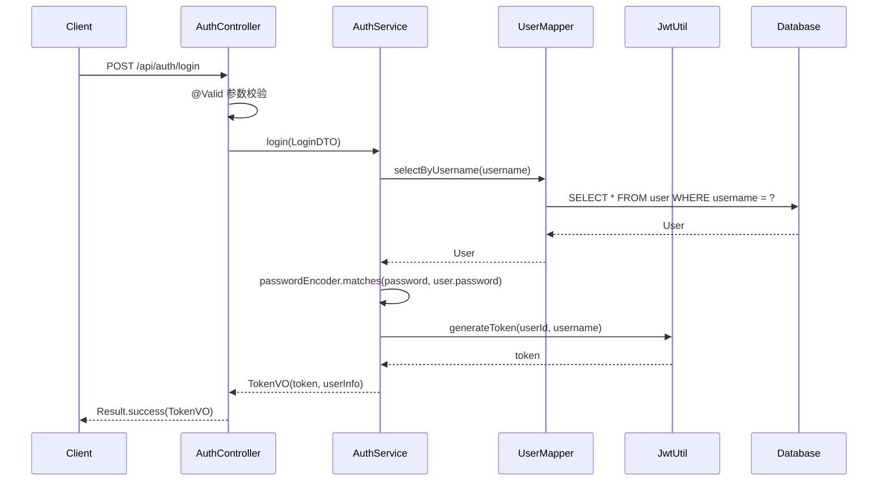
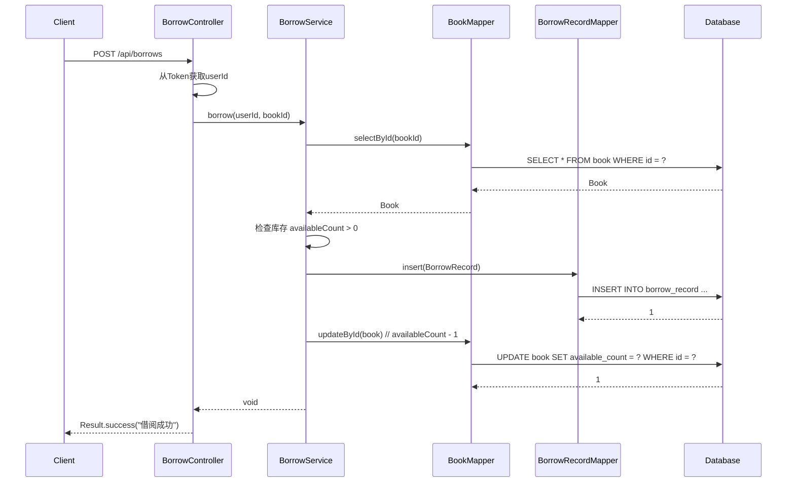

# 图书管理系统 - 项目设计文档

## 1. 系统架构

## 2. ER 图

## 3. 接口清单

### 3.1 AuthController - 认证接口
| 方法 | 路径 | 描述 |
|------|------|------|
| POST | /api/auth/register | 用户注册 |
| POST | /api/auth/login | 用户登录 |
| POST | /api/auth/logout | 用户退出 |
| GET | /api/auth/info | 获取当前用户信息 |

### 3.2 BookController - 图书接口
| 方法 | 路径 | 描述 |
|------|------|------|
| GET | /api/books | 分页查询图书 |
| GET | /api/books/{id} | 获取图书详情 |
| POST | /api/books | 新增图书 |
| PUT | /api/books/{id} | 编辑图书 |
| DELETE | /api/books/{id} | 删除图书 |
| GET | /api/books/new | 获取新书推荐 |

### 3.3 BorrowController - 借阅接口
| 方法 | 路径 | 描述 |
|------|------|------|
| POST | /api/borrows | 借阅图书 |
| PUT | /api/borrows/{id}/return | 归还图书 |
| PUT | /api/borrows/{id}/confirm | 确认归还 |
| GET | /api/borrows/current | 当前借阅列表 |
| GET | /api/borrows/history | 借阅历史记录 |

### 3.4 UserController - 用户管理接口 (管理员)
| 方法 | 路径 | 描述 |
|------|------|------|
| GET | /api/users | 分页查询用户 |
| PUT | /api/users/{id}/status | 修改用户状态 |

## 4. UI/UX 规范

### 4.1 色彩系统
- 主色调: `#409EFF` (Element Plus 默认蓝)
- 成功色: `#67C23A`
- 警告色: `#E6A23C`
- 危险色: `#F56C6C`
- 信息色: `#909399`
- 背景色: `#F5F7FA`
- 卡片背景: `#FFFFFF`

### 4.2 字体规范
- 主字体: `-apple-system, BlinkMacSystemFont, 'Segoe UI', Roboto, 'Helvetica Neue', Arial`
- 标题字号: 20px / 18px / 16px
- 正文字号: 14px
- 辅助文字: 12px

### 4.3 间距规范
- 页面边距: 24px
- 卡片内边距: 20px
- 元素间距: 16px / 12px / 8px

### 4.4 圆角规范
- 卡片圆角: 8px
- 按钮圆角: 4px
- 输入框圆角: 4px

## 5. UML 类图

### 5.1 用户认证相关类

### 5.2 图书管理相关类

## 6. 时序图

### 6.1 用户注册时序图

### 6.2 用户登录时序图

### 6.3 图书借阅时序图

